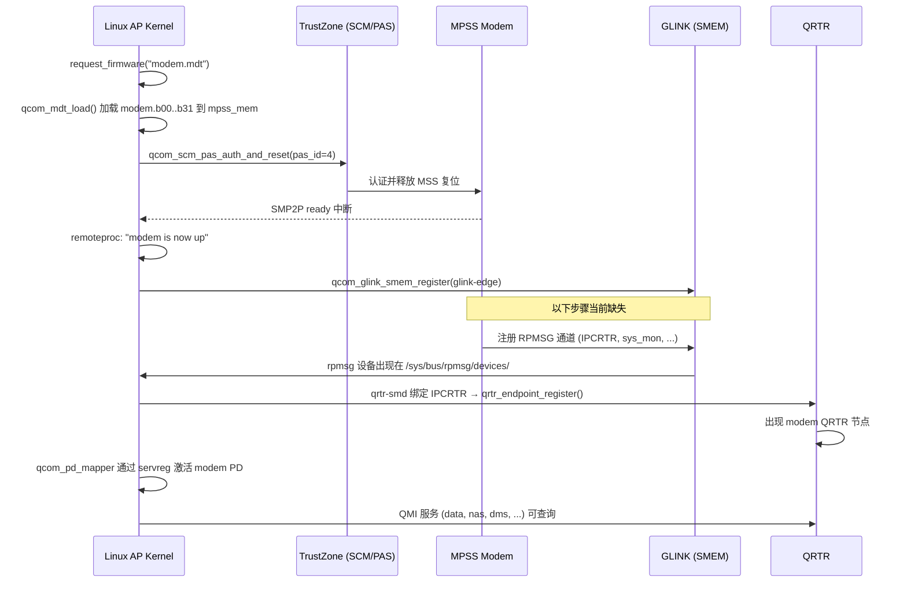

# Xiaomi Raphael (Redmi K20 Pro) Modem 固件与 Linux 7.0 通信指南

本文档说明 `modem.mdt` 的工作机制、Raphael 固件包结构，以及在 **Linux 7.0 mainline** 上从固件加载到 QRTR/QMI 通信的完整链路。针对当前状态（modem 已启动但 GLINK 通道与 QRTR 节点未出现）给出排查路径。

---

## 1. 当前状态解读

| 层级 | 你的状态 | 含义 |
|------|----------|------|
| 设备树 `glink-edge` | ✅ | AP 侧 GLINK 传输端点已在 DT 中正确描述 |
| `qcom_glink` / `qcom_glink_smem` | ✅ | 内核 GLINK 传输驱动已加载 |
| Modem remoteproc | ✅ `modem is now up` | **PIL/PAS 层**已将 MPSS 固件载入并收到 ready 中断 |
| GLINK 通道 / RPMSG 设备 | ❌ | Modem **应用层**尚未在 GLINK 上注册服务（`IPCRTR`、`sys_mon` 等） |
| QRTR 节点 | ❌ | `qrtr-smd` 未绑定到 `IPCRTR` rpmsg 设备，故无 modem QRTR 节点 |

**关键结论：** `modem is now up` 只表示 **remoteproc 启动成功**，不等于 modem 协议栈已完全就绪。你卡在 **GLINK 服务注册** 这一层，QRTR 是下游症状。

---

## 2. `modem.mdt` 文件解析

### 2.1 文件性质

`modem.mdt` 不是普通二进制固件，而是 Qualcomm **MDT（Multi-image Data Table）** 清单：

- 格式：**ELF32**，架构 `QUALCOMM DSP6 Processor`
- 入口点：`0x8e000000`（与 DT 中 `mpss_mem` 起始地址一致）
- 含 **33 个 Program Header**，其中 **31 个 PT_LOAD** 段
- 每个可加载段对应一个分段文件：`modem.b00` … `modem.b31`（由 `mdt_loader` 按段号替换 `.mdt` 后缀生成文件名）

### 2.2 内存布局（节选）

| 段 | 物理地址 | 大小 | 权限 | 说明 |
|----|----------|------|------|------|
| b02 | `0x8e000000` | 12 KB | R-X | MBA/PBL 入口代码 |
| b09 | `0x8e0e0000` | 2.5 MB | R-X | 主 MPSS 代码 |
| b18 | `0x96440000` | ~700 KB | R-- | 只读数据 |
| b22 | `0x94710000` | ~29 MB | RW- | 大块 BSS/堆 |

Raphael DT 预留区：

```dts
mpss_mem: memory@8e000000 {
    reg = <0x0 0x8e000000 0x0 0x9600000>;  /* 150 MB */
};
```

固件最大占用约 `0x96a1d000 + 0x00be3000 - 0x8e000000` ≈ 142 MB，在 150 MB 预留区内。

### 2.3 伴随文件

| 文件/目录 | 作用 |
|-----------|------|
| `modem.b00`–`modem.b31` | MDT 各 ELF 段的实际载荷 |
| `modemr.jsn` | ServReg：modem `root_pd` 域服务列表（`tms/servreg`、`gps/gps_service` 等） |
| `modemuw.jsn` | ServReg：modem `wlan_pd` 域（`kernel/elf_loader`、`wlan/fw`） |
| `modem_pr/mcfg/` | 运营商/区域 MBN 配置（VoLTE、APN 等），经 **RMTFS** 提供给 modem |

---

## 3. 完整启动与通信流程



### 3.1 内核加载路径（代码）

1. **DT 绑定**：`remoteproc_mpss` → `compatible = "qcom,sm8150-mpss-pas"`
2. **驱动**：`drivers/remoteproc/qcom_q6v5_pas.c`（`mpss_resource_init`：pas_id=4, ssr_name="mpss"）
3. **固件解析**：`drivers/soc/qcom/mdt_loader.c` — 读 ELF phdr，按段请求 `modem.bNN`
4. **认证启动**：`qcom_scm_pas_auth_and_reset()` 经 TZ 校验签名并启动
5. **子设备注册**（`qcom_add_glink_subdev` / `qcom_add_smd_subdev` / `qcom_add_sysmon_subdev` / `qcom_add_pdm_subdev`）
6. **GLINK 启动**：`qcom_glink_smem_register()` — SMEM FIFO + mailbox + IRQ

### 3.2 SM8150 与旧平台的 QRTR 差异

- **SDM845 及更早**：modem 有 `smd-edge`，QRTR 走 SMD 传输
- **SM8150 及更新**：modem **仅** 有 `glink-edge`，**无** `smd-edge`（见 `sm8150.dtsi`）

上游 `net/qrtr/smd.c` 名字叫 “SMD”，实际绑定的是 **rpmsg 设备名 `IPCRTR`**，与底层传输无关。只要 modem 在 GLINK 上暴露名为 `IPCRTR` 的 rpmsg 通道，`qrtr-smd` 即可工作。**不需要单独的 qrtr-glink 驱动**。

---

## 4. Linux 7.0 内核配置

`arch/arm64/configs/raphael.config` 当前 **缺少** 以下 modem 关键项（仅有 ADSP 的 `QCOM_Q6V5_ADSP`）：

```kconfig
# Remoteproc / Modem
CONFIG_QCOM_Q6V5_PAS=m          # MPSS/ADSP/CDSP PAS 加载器（必需）
CONFIG_QCOM_SYSMON=m            # sys_mon RPMSG + SSCTL QMI
CONFIG_QCOM_PD_MAPPER=m         # servreg 域映射（默认随 RPROC_COMMON）

# RPMSG / GLINK
CONFIG_RPMSG=y
CONFIG_RPMSG_CHAR=y
CONFIG_RPMSG_QCOM_GLINK=y
CONFIG_RPMSG_QCOM_GLINK_SMEM=m  # modem/adsp glink-edge 传输

# QRTR
CONFIG_QRTR=y
CONFIG_QRTR_SMD=y               # 绑定 IPCRTR rpmsg 设备

# 共享内存 / 启动依赖
CONFIG_QCOM_SMEM=y
CONFIG_QCOM_AOSS_QMP=y
CONFIG_QCOM_RMTFS_MEM=y

# 数据通路（蜂窝上网，GLINK/QRTR 就绪后）
CONFIG_QCOM_IPA=m
CONFIG_QRTR_MHI=m               # 仅外置 MHI modem；SM8150 内置 modem 不需要
```

验证已加载模块：

```bash
lsmod | grep -E 'qcom_q6v5_pas|glink|qrtr|sysmon|pd_mapper'
```

---

## 5. 固件部署

### 5.1 安装路径

内核 firmware loader 查找：

```
/lib/firmware/qcom/sm8150/Xiaomi/raphael/modem.mdt
/lib/firmware/qcom/sm8150/Xiaomi/raphael/modem.b00
...
/lib/firmware/qcom/sm8150/Xiaomi/raphael/modem.b31
```

DT 中已指定：

```dts
&remoteproc_mpss {
    status = "okay";
    firmware-name = "qcom/sm8150/Xiaomi/raphael/modem.mdt";
};
```

### 5.2 从本仓库安装

```bash
cd firmware-xiaomi-raphael
sudo cp -a usr/lib/firmware/qcom /lib/firmware/
# ServReg JSON 与 mcfg 建议一并部署（RMTFS 用）
sudo cp -a usr/lib/firmware/qcom/sm8150/Xiaomi/raphael/modem_pr /lib/firmware/qcom/sm8150/Xiaomi/raphael/
```

### 5.3 启动顺序建议

1. **ADSP** 先启动（`adsp.mdt`）— audio/QMI 依赖
2. **RMTFS 用户态服务**（若使用）— 向 `rmtfs_mem` 提供 EFS/mcfg
3. **MPSS**（`modem.mdt`）
4. **IPA** 固件（`qcom/ipa_fws.mdt`）— 数据面

```bash
# 手动触发（若未自动 boot）
echo start > /sys/class/remoteproc/remoteproc*/state   # 找到 mpss 对应项
```

---

## 6. 设备树要点（Raphael）

除 `glink-edge` 外，还需确认：

| 节点 | 作用 |
|------|------|
| `mpss_mem @ 0x8e000000` | Modem 固件内存（必须与下游一致） |
| `rmtfs_mem @ 0xfe101000` | Modem RMTFS 共享内存（`qcom,client-id = <1>`） |
| `smp2p-mpss` | AP↔Modem 状态/中断（ready/fatal 等） |
| `remoteproc_mpss/glink-edge` | `label = "modem"`, `qcom,remote-pid = <1>` |
| `&ipa` | 蜂窝数据 IPA 卸载 |

---

## 7. 正常通信所需链路

达到 **可拨打/上网** 需要整条链就绪：

```
modem.mdt 启动
  → GLINK 通道 (IPCRTR, sys_mon, ...)
    → QRTR 节点 + qcom_pd_mapper (servreg)
      → QMI 服务 (e.g. 0x0B 数据, 0x03 NAS, 0x02 DMS)
        → IPA + rmnet / qmi_wwan
          → 用户态 ModemManager / libqmi
```

仅完成第一步时，只能看到 `modem is now up`，不会有 QRTR。

---

## 8. 故障排查（针对 GLINK 通道未创建）

### 8.1 快速检查命令

```bash
# 1. RPMSG 设备（核心：应有 IPCRTR、sys_mon 等）
ls -la /sys/bus/rpmsg/devices/

# 2. remoteproc 状态
grep -H . /sys/class/remoteproc/remoteproc*/{name,state,firmware}

# 3. 内核日志
dmesg | grep -iE 'glink|rpmsg|qrtr|sysmon|IPCRTR|mpss|pas|servreg|pdr|rmtfs'

# 4. GLINK / SMP2P
dmesg | grep -iE 'smp2p|mbox|smem'

# 5. QRTR 套接字（需 CONFIG_QRTR）
ss -f qrtr 2>/dev/null || ls /sys/kernel/debug/qrtr/ 2>/dev/null

# 6. RMTFS 字符设备
ls -la /dev/rmtfs* 2>/dev/null
```

**期望结果（正常时）：**

```
/sys/bus/rpmsg/devices/virtio0.IPCRTR.-1.0
/sys/bus/rpmsg/devices/virtio0.sys_mon.-1.1
...
dmesg: Qualcomm SMD QRTR driver probed    # 绑定 IPCRTR 时
dmesg: qcom_sysmon probe                   # 绑定 sys_mon 时
```

### 8.2 常见根因（按优先级）

#### A. Modem 应用层未完全初始化（最可能）

PIL 成功 ≠ MPSS 服务就绪。Modem 常在启动早期通过 **RMTFS** 读取：

- EFS 校准分区镜像
- `mcfg_sw.mbn` / `mcfg_hw.mbn`（在 `modem_pr/mcfg/`）

Mainline 仅有 `rmtfs_mem` 驱动（`/dev/rmtfs1`），**没有** Android 的 `rmtfs`/`tftp` 守护进程时，modem 可能卡在等待文件系统，**不会注册 GLINK 服务**。

**对策：**

- 部署 postmarketOS 的 `rmtfs` 用户态服务，或自行实现将 `modem_pr` 内容写入 rmtfs 共享内存
- 确保 EFS/modem 分区数据可用（可从 Android 备份 `modemst1`/`modemst2`/`fsg` 等）

#### B. 内核模块缺失

确认 `qcom_q6v5_pas`、`qcom_glink_smem`、`qrtr_smd`、`qcom_sysmon` 已加载。`raphael.config` 默认未启用 PAS/GLINK_SMEM。

#### C. ADSP 未启动

部分 modem 服务依赖 ADSP。确认：

```bash
grep adsp /sys/class/remoteproc/remoteproc*/name
# state 应为 running
```

#### D. SMP2P / Mailbox 异常

`glink-edge` 使用 `mboxes = <&apss_shared 12>` 和 `interrupts = <GIC_SPI 449 ...>`。若 mailbox 或 smp2p 未工作，GLINK 握手失败。检查 dmesg 中 `mbox`、`smp2p` 错误。

#### E. 内存布局不匹配

`mpss_mem` / `rmtfs_mem` 地址必须与 Xiaomi 下游一致。Raphael 已重写 reserved-memory；若使用错误 DTB，modem 可能 boot 但运行异常。

#### F. TZ/PAS 认证问题

若使用未解密固件或错误签名，通常无法到达 `modem is now up`。你已越过此步，优先级较低。

---

## 9. 建议修复步骤

### 步骤 1：补全内核配置并重新编译

将第 4 节 Kconfig 项加入 `raphael.config`，重新 build + install modules。

### 步骤 2：确认 RPMSG 是否出现

启动 modem 后：

```bash
ls /sys/bus/rpmsg/devices/
```

- **仍为空** → 问题在 modem 固件/RMTFS/内存，不是 QRTR 配置
- **有设备但无 IPCRTR** → modem 部分初始化；查 mcfg/EFS
- **有 IPCRTR** → 检查 `qrtr_smd` / `qrtr` 模块

### 步骤 3：部署 RMTFS 服务

参考 postmarketOS [rmtfs-copy-files](https://gitlab.com/postmarketOS/pmaports/-/merge_requests/4674)：

1. 将 `modem_pr/mcfg/configs/mcfg_sw/mbn_sw.dig` 等索引文件放入 rmtfs
2. 启动 `rmtfs` daemon 后再 boot modem（或先 boot modem 但 daemon 必须尽快就绪）

### 步骤 4：验证 QRTR

```bash
# 安装 qmicli / libqmi
qmicli -d qrtr:0 -u --dms-get-capabilities   # 0 为 modem 节点号，以实际为准
```

### 步骤 5：数据面（IPA）

```bash
modprobe qcom_ipa
# DT: &ipa status = "okay", firmware-name = "qcom/ipa_fws.mdt"
```

---

## 10. 文件索引

| 路径 | 说明 |
|------|------|
| `usr/lib/firmware/qcom/sm8150/Xiaomi/raphael/modem.mdt` | MDT 清单（ELF） |
| `usr/lib/firmware/qcom/sm8150/Xiaomi/raphael/modem.b*` | 分段固件 |
| `usr/lib/firmware/qcom/sm8150/Xiaomi/raphael/modemr.jsn` | root_pd servreg |
| `usr/lib/firmware/qcom/sm8150/Xiaomi/raphael/modemuw.jsn` | wlan_pd servreg |
| `usr/lib/firmware/qcom/sm8150/Xiaomi/raphael/modem_pr/` | MCFG 配置 |
| `linux/arch/arm64/boot/dts/qcom/sm8150-xiaomi-raphael.dts` | 设备树 |
| `linux/drivers/remoteproc/qcom_q6v5_pas.c` | PAS 驱动 |
| `linux/drivers/soc/qcom/mdt_loader.c` | MDT 加载器 |
| `linux/net/qrtr/smd.c` | QRTR ↔ IPCRTR 绑定 |

---

## 11. 总结

| 问题 | 答案 |
|------|------|
| `modem.mdt` 是什么？ | Qualcomm ELF 格式多镜像清单，指导将 `modem.bNN` 载入 `mpss_mem` 并经 TZ 认证启动 |
| 为何 modem up 但无 QRTR？ | GLINK 上未出现 `IPCRTR` rpmsg 设备；QRTR 是 GLINK 服务的消费者 |
| SM8150 需要 qrtr-glink 吗？ | **不需要**；`qrtr-smd` 通过 rpmsg 名 `IPCRTR` 工作，传输层已是 GLINK |
| 最可能缺什么？ | **RMTFS 用户态** + 完整内核模块 + mcfg/EFS 数据 |
| 下一步？ | 查 `/sys/bus/rpmsg/devices/`，部署 rmtfs，补全 `raphael.config` |

---

*生成自 Linux 7.0 / sm8150-xiaomi-raphael 树分析，固件包 firmware-xiaomi-raphael。*
